# Introducción

### ¿Qué es un patrón de puntos?

-   Base de datos de cosas o eventos en espacio 

```{r patron, echo = F, fig.cap="Patrones de puntos de densidad variable. A la izquierda células de mucosa gástrica en corte histológico. A la derecha, cúmulos de galaxias (Baddeley et al. 2016).", fig.dim = "20%", dpi=450}
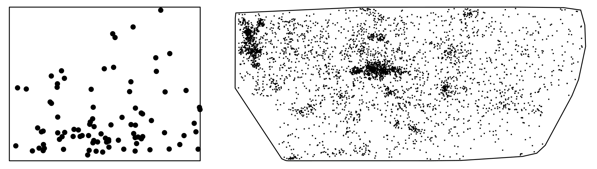
```

- Densidad $\rightarrow$ conteos/unidad espacial

### La intensidad de puntos

```{r echo = F, fig.cap="Ejemplo de medición de intensidad de puntos", fig.width=7, dpi = 400, fig.dim = "30%"}
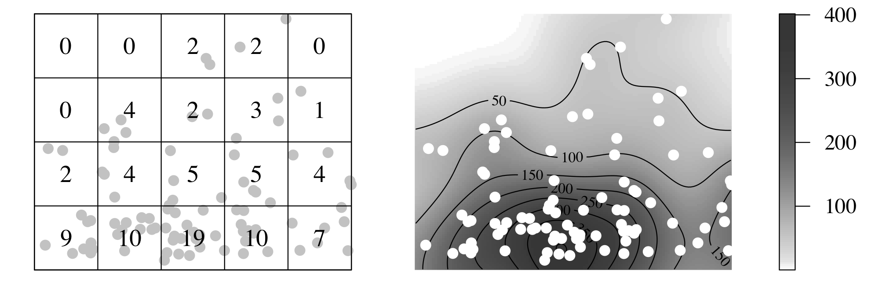
```


### Tipos de puntos

Puntos pueden representar tipos de objetos

```{r tipos-puntos, echo = F, fig.cap="Ubicaciones de dos especie de árbol, abeto y roble, en la misma parcela.", fig.dim="30%"}
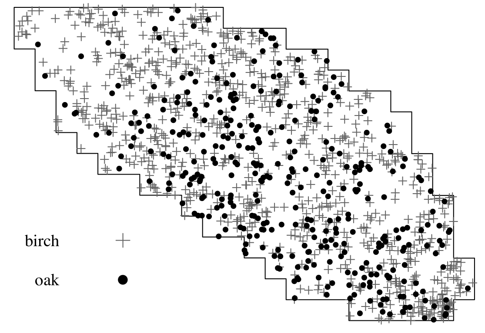
```

### Tipos de puntos

Puntos pueden representar mediciones

```{r tipos-puntos-2, echo=F, fig.cap="Ubicaciones de árboles con mediciones de diámetro.", fig.dim="30%", dpi = 450}
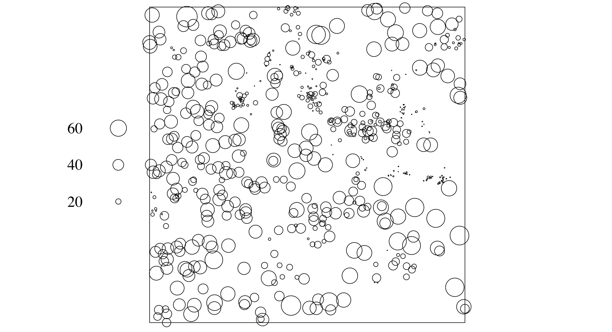
```

### Tipos de puntos

Puntos pueden estar definidos en 1-4 dimensiones

```{r dimensiones, echo = F, fig.cap="Ejemplos de procesos de puntos en 1 y 3 dimensiones", fig.dim = "30%", dpi = 450}
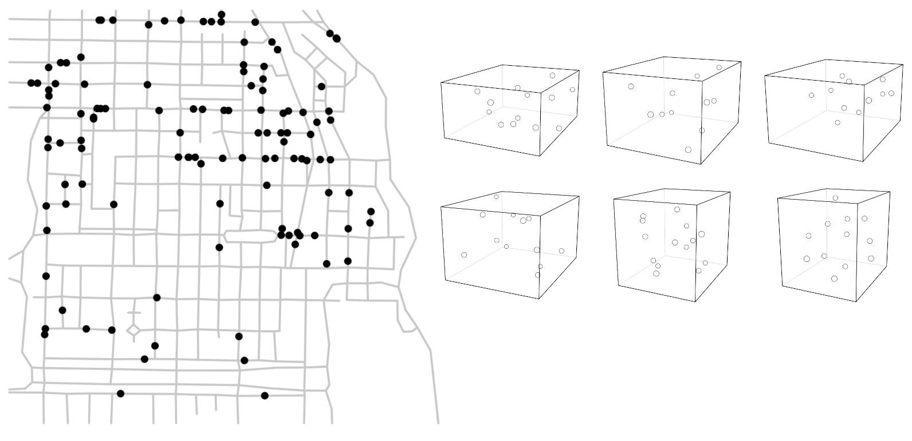
```

### Covariables

Los procesos de puntos pueden estar definidos en relación a covariables.

```{r covar, echo = F, fig.cap="Datos de Beilschmiedia pendula sobre un modelo digital de elevación.", fig.dim="30%", dpi = 450}
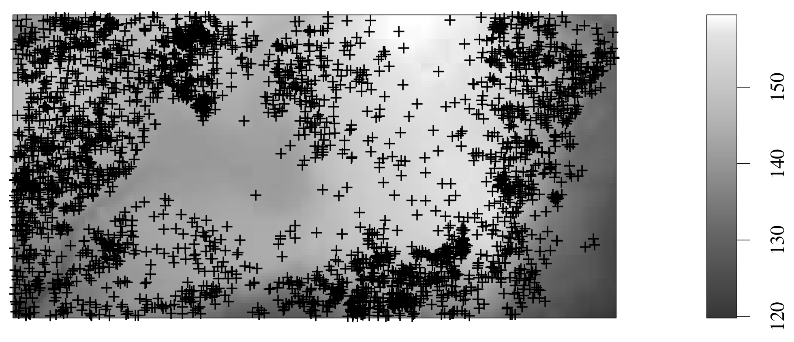
```

### El modelado de procesos de puntos

- Estimar variación de densidad

- Densidad = No. puntos / unidad de área

```{r cont-estim, echo = F, fig.cap="Se analiza un patrón para predecir variación contínua.",fig.dim="30%", dpi = 250}
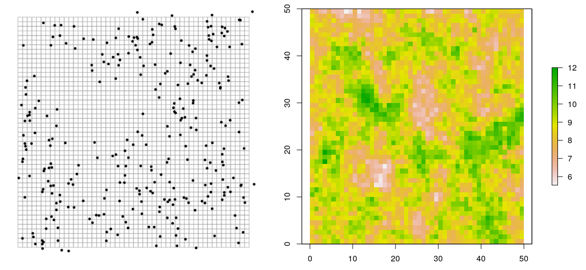
```

### Procesos de puntos en ecología

- Datos más comunes $\rightarrow$ sólo presencia

- Colecciones de patrones de puntos

```{r colecciones, echo = F, fig.cap="Repositorios comunes de información de biodiversidad.", fig.dim="30%", dpi = 450}

```

# Análisis de procesos de puntos

### Es un análisis regresión

- Medir relación entre $x$ y $y$ que son contínuas

    - ¿Cómo afecta $x$ al promedio de $y$?

- $x$ produce a $y$

    - $x$ variable independiente
    - $y$ variable dependiente
    
### Ejemplo - Datos contínuos

```{r echo = F}
set.seed(123)

x <- rnorm(100)
beta <- rnorm(100, 0, 1)
y <- x + beta

df <- data.frame(x = x, y = y)

knitr::kable(head(df))
```

### Ejemplo - Gráfica de dispersión

```{r echo=F, fig.height=4, fig.width=4}
with(df, plot(x, y, col = "red"))
```

### Ejemplo - Regresión lineal

- Regresión:

$$ y(x) = \alpha + \beta_1 x_1 + \dots + \beta_n x_n + \varepsilon$$
- $x$ son las variables ambientales

- $y$ es la intensidad por unidad de área

- $\alpha, \beta_i$ son los efectos de $x$ sobre $y$

- $\varepsilon$  es el error, varianza de $y$ que $x$ no explica

### Ejemplo - La línea de regresión

```{r echo = F, fig.height=4, fig.width=4}
plot(x, y, col = "red")
abline(0, 1, col = "red")
```

### Ejemplo - La ecuación

- $y = \alpha + \beta \times x$

- $\alpha = 0$

- $\beta = 1$

**Regresión consiste en estimar todos los coeficientes para las variables** $x$.

### Diferencias entre regresión y PPs

- Regresión lineal simple
    
    - $-\infty > y < \infty$, $y \in \mathbb{R}$
    -  $y \approx \mathcal{N}$ (distribución Normal)
    
- Procesos de puntos 

    - $y > 0$, $y \in \mathbb{Z}$
    - $y \approx \mathcal{P}$ (distribución Poisson)
    
### Diferencias entre regresión y PPs

Para que $y >0$

- Regresión lineal

    - $y(x) = \alpha + \beta_1 x_1 + \dots$

- Regresión log-lineal

    - $\log y(x) = \alpha + \beta_1 x_1 + \dots$

### Relación con métodos populares en MNE

```{r echo=F, fig.dim="30%", dpi = 350, fig.align='center'}
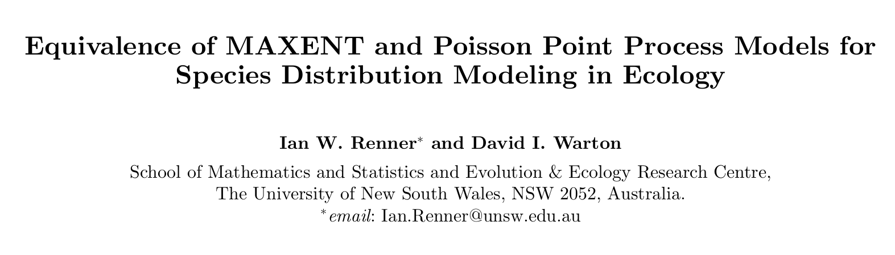
```

### Gráficamente

```{r echo = F, fig.dim="30%", dpi = 300, fig.align='center'}
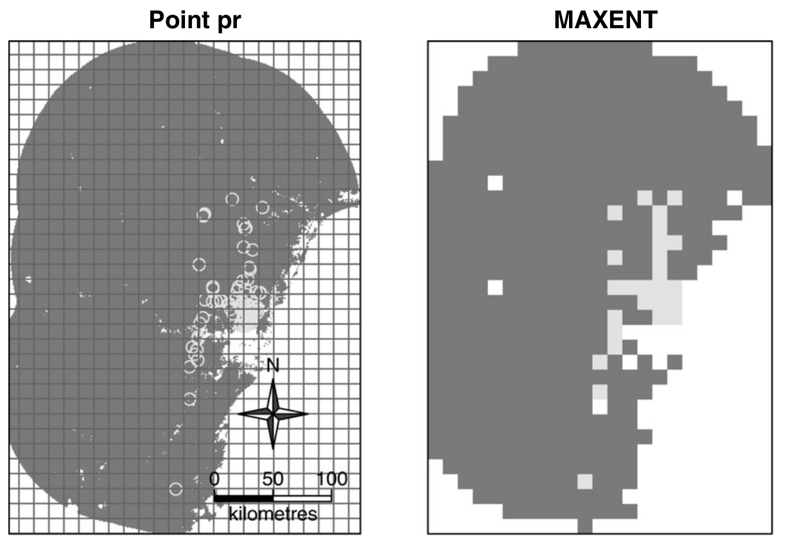
```

### Los modelos ajustados

$$\ln \pi(g_i ) = \ln \mu(g_i ) = x(g_i) \beta$$

Son funciones log-lineales equivalentes de un conjunto de predictores

- Maxent: maximiza la entropía

- Procesos de puntos en general: maximizan verosimilitud Poisson (conteo  de puntos por unidad espacial)

### Comparaciones extensivas

- Equivalentes a MaxEnt

    - Sin Regularización
    - *Features* lineal y cuadrática
    
```{r maxent, echo = F, dpi=400}
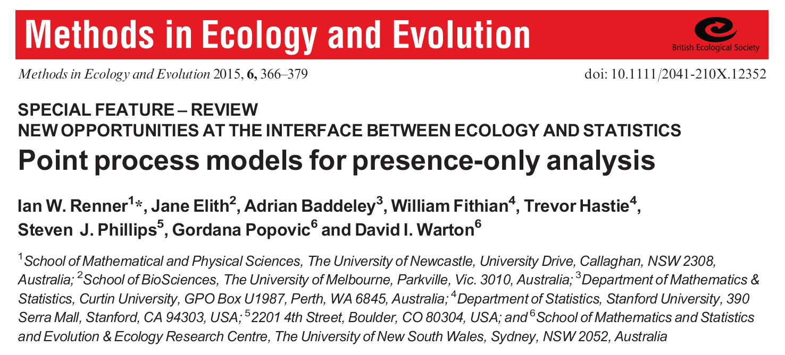
```

### Relación con otros métodos

- Regresión log-lineal

    - Logística
    - Maxent

- Elipsoides (Martín et al. 2022)

    - Centroide existe en espacio
    - Sin colinealidad

### Relación con otros métodos

Condiciones para equivalencia entre MPPs y envolturas

```{r evm, echo = F, fig.dim="30%", dpi=400}
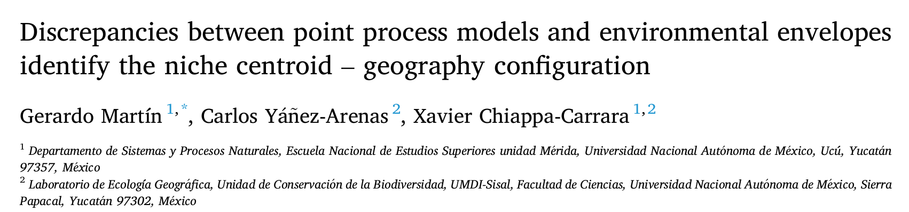
```

# Ventajas y Desventajas

### Ventajas

- Herramienta *ad-hoc* para puntos
- Transparencia
- Herramientas exploratorias $\rightarrow$ identificar variables
- Estimación de efectos estadísticos
- Tipos de puntos $\rightarrow$ interacciones biológicas
- Extensiones para modelar estructura espacial (maximizar utilidad de datos)
- Herramientas diagnósticas

### Desventajas

- Formateo
- Difícil automatizar
- Más programación
- Selección de modelo laboriosa
- Optimización puede ser difícil
- Poco práctico para muchas especies

### Bibliografía básica

```{r spat-book, echo =FALSE, fig.dom = "30%", dpi = 300, fig.align='center'}
knitr::include_graphics("Figuras/Spat-book.png")
```

