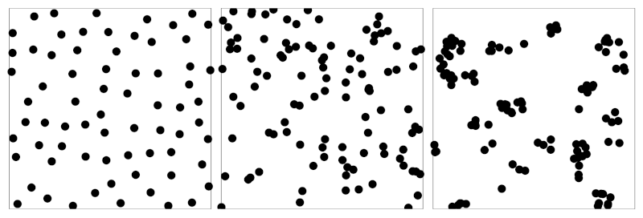

### Supuestos

*Todos hacemos suposiciones y casi todas estan mal*  (Einstein)

- Identificar bajo qué condiciones podemos estar equivocadxs

### Supuestos

**Estadísticos**
- Supuestos $\rightarrow$ Errores potenciales $\rightarrow$ Soluciones potenciales

**Biológicos**
- Supuestos estadísticos $\rightarrow$ Problema de estudio $\rightarrow$ Interpretaciones

### Supuestos estadísticos

- Variable analizada / Modelo estadístico
- Significado de los resultados

- MPPs $\rightarrow$ diferentes supuestos estadísticos

    - Distribución estadística de presencias
    - Independencia
    - Sesgo observacional
    
### Supuestos estadísticos - Ejemplos

Media aritmética

  - Valor más probable en distribución normal
  
```{r echo=F, fig.height=4, fig.width=4}
set.seed(5145)

x1 <- rnorm(100)

plot(density(x1), col = "red", xlab = "x", ylab = "Densidad")
abline(v = mean(x1), col = "red", lty = 3)
```
  
### Supuestos estadísticos - Ejemplos

```{r echo=F, fig.height=4, fig.width=4}
x1.1 <- exp(x1)

plot(density(x1.1), col = "red", xlab = "x", ylab = "Densidad")
abline(v = mean(x1.1), col = "red", lty = 3)
```

### Supuestos de MPPs

- Intensidad de puntos promedio ($\lambda(u)$) tiene distribución Poisson
- Los puntos son **independientes**
- $\lambda(u)$ es log-lineal

# Dependencia espacial

### Autocorrelación

Puntos se repelen $\rightarrow$ Puntos son independientes $\rightarrow$ Puntos se atraen

```{r echo = F, fig.align='center'}

```

### Autocorrelación

Moran-*I* > 1

```{r echo = F, fig.align='center'}

```

### Autocorrelación

Moran-*I* $\approx$ 0

```{r echo = F, fig.align='center'}

```

### Autocorrelación

- Verificar, medir supuesto $\rightarrow$ Proponer soluciones

- Pruebas estadísticas

    - *K* Ripley
    - *L* Besag

# ¿Qué se hace si no se cumplen supuestos?

### Modificar MPPs


