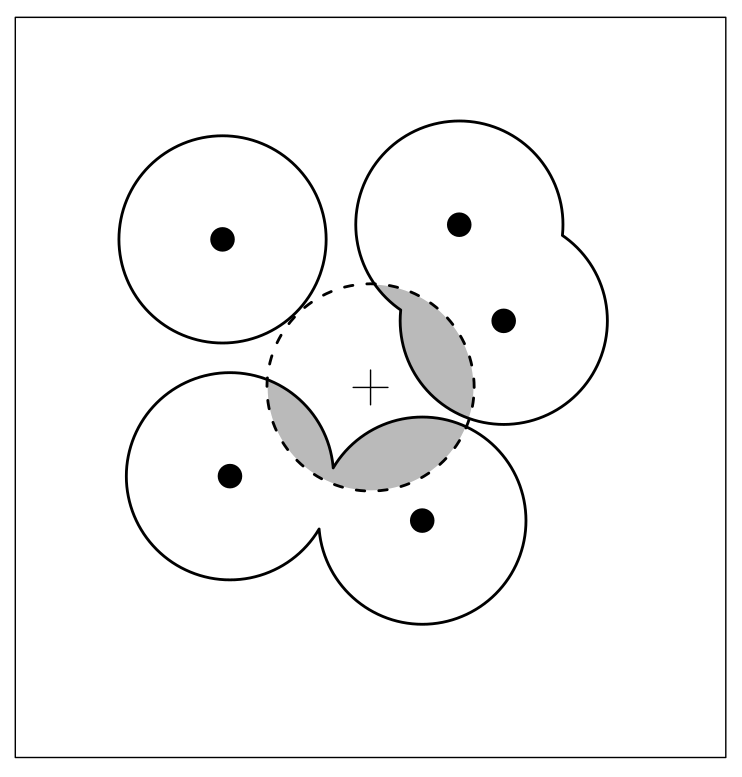
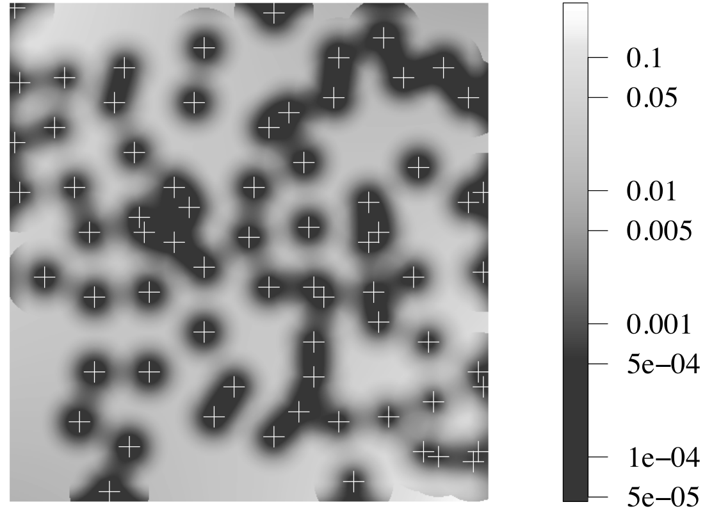
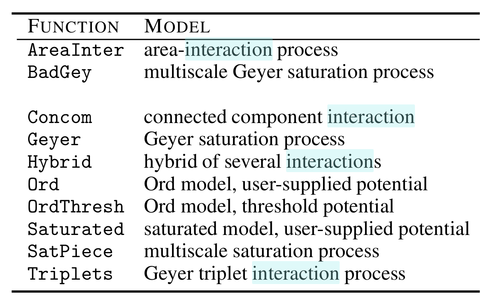

```{r setup, include=FALSE}
knitr::opts_chunk$set(dev = 'pdf')
```

# Simulación de presencias

### Especificación de un centroide

```{r echo = F, message=F, warning=F}
library(terra); library(foreach); library(spatstat)

r <- aggregate(rast("Datos/Bioclim-CHELSA.tif"), 2) 
r <- round(scale(r), 2)

puntos <- read.csv("Datos/Puntos-analisis.csv")
```

- `aggregate` disminuye la resolución por el factor indicado

- `round` redondea los valores con el número de decimales

- **Estos pasos no son enteramente necesarios en un análisis real, los hacemos para disminuir tiempo de cómputo**

### Código - viendo la favorabilidad

```{r fig.height=3.5, fig.width=7, fig.align='center', echo = F}
fav.real <- rast("Datos/Fav-real.tif")
par(mfrow = c(1, 2))
plot(fav.real)
plot(fav.real); points(puntos, col = "red", pch = 20, cex = 0.05)
```

# Formateo para spatstat

### Cargando las funciones

```{r}
source("Funciones-spatstat/imFromStack.R")
source("Funciones-spatstat/plotQuantIntens.R")
source("Funciones-spatstat/findCompatibles.R")
source("Funciones-spatstat/getPolyFormulas.R")
source("Funciones-spatstat/ppmBatchFit.R")
```

### Formateo rápido

```{r}
r.im <- imFromStack(r)
names(r.im) <- names(r)
w <- as.owin(r.im[[1]])
puntos.ppp <- ppp(x = puntos$x,
                  y = puntos$y,
                  window = w,
                  check = F)
Q <- pixelquad(X = puntos.ppp, W = as.owin(w))
```

# Análisis exploratorio

### Autocorrelación

Función de *K* de Ripley

1. Número promedio de vecinos como función de la distancia a cada punto:

```{r echo = F, fig.width=3.5, fig.height=3.5, fig.cap = "Buffers  de 0.1 a 0.5° alrededor de cada punto. El número de vecinos se cuenta por puntos dentro de cada buffer.", fig.align='center'}
puntos.v <- vect(data.frame(lon = puntos$x, lat = puntos$y)[1:15, ])
b <- lapply(seq(0.1, 0.5, by = 0.1), function(x){buffer(puntos.v, x)})
plot(puntos.v, pch = 20, cex = 0.5, col = "red")
for(i in seq_along(b)){lines(b[[i]], col = "grey")} 
```
### Los datos

```{r echo = F}
no.vec <- data.frame(Radio = seq(0.1, 0.5, by = 0.1),
                     Vecinos = c(0, 1/15, 3/15, 4/15, 4/15))
knitr::kable(no.vec)
```

### Representación gráfica

```{r echo = F, fig.width=4, fig.height=3.5, fig.align="center"}
plot(Vecinos ~ Radio, data = no.vec, type = "s")
```
###  Implementación en spatstat

```{r results='hide'}
K <- envelope(puntos.ppp, fun = Kest, nsim = 39)
```

Para estimar significancia hace un muestreo aleatorios de punto, de ahí que haya que especificar el número de simulaciones (`nsim = 39`).

### Interpretación gráfica 

```{r echo = F, fig.height=3.5, fig.width=4, fig.align='center'}
plot(K)
```

### Autocorrelación - notas

1.  El proceso está levemente autocorrelacionado

    - Veremos si la correlación presente es explicada por factores ambientales

2.  No sabemos de momento si afectará al modelo

# Análisis 2.0

### Respuestas a variables

```{r results = "hide", message=FALSE, warning=FALSE}
plotQuantIntens(imList = r.im,
                noCuts = 5,
                Quad = Q,
                p.pp = puntos.ppp,
                dir = "",
                name = "Respuestas-centroide")
```

[Ver archivo de gráficas](Respuestas-centroide.pdf)

### Consideraciones para proponer modelos

Curvas con forma de campana $\rightarrow$ fórmula cuadrática

```{r fig.height=3.5, fig.width=3.5}
curve(exp(1 + x - x^2), from = -3, 3)
```

### Consideraciones para proponer modelos

Ecuación lineal:

$$ y = \alpha + \beta_1 x_1 + \dots + \beta_n x_n$$ Ecuación polinomial de 2$^o$ grado

$$ y = \alpha + \beta_1 x_1 + \beta_1' x_1^2 + \dots + \beta_n x_n + \beta_n' x_n^2$$ Recordemos que $y = \log \lambda$

### ¿Qué variables podemos incluir en el mismo modelo?

**Regla de oro**: Aquellas que no estén correlacionadas

-   Que $x_1$ no sea predictor de $x_2$
-   No se puede atribuir efecto de $x_1$ ó $x_2$ sobre $\lambda$
-   Necesitamos medir correlación entre pares de variables (`pairs`)

### Identificación automática de covariables *compatibles*

```{r message=F, warning=F,, echo = T}
compatibles <- findCompatibles(r, thres = 0.5, 
                               max.comb = 3)
```

```{r echo=F}
knitr::kable(head(compatibles))
```

### Obteniendo las fórmulas

- Necesitamos generar una tabla de exponentes para variables, usando el resultado de [`plotQuantIntens`](Respuestas-centroide.pdf).

- Razonamiento:

    - Identificar exponente máximo que tendrá el modelo para cada variable
    
    - La función `getPolyFormulas` generará las fórmulas para todas las combinaciones con exponentes $1:n$

- Tabla debe tener dos columnas: `Variable`, `Power`

### Uso de `getPolyFormulas`

```{r message = F, warning = F, echo = T}
expon <- read.csv("Datos/Tabla-coefs.csv")
formulas  <- getPolyFormulas(respDF = expon, 
                             compatMat = compatibles)
formulas[1:5]
```

### Ajustando los modelos

- La función `ppmBatchFit` ajustará todos los modelos generados por `getPolyFormulas`

-  Algunos modelos no lograrán estimar coeficientes satisfactoriamente

- La implementación presente solamente puede priorizar con base en AIC

- En un futuro, eliminará modelos que con converjan

### Uso de `ppmBatcchFit`

```{r results = "hide", echo=TRUE}
modelos <- ppmBatchFit(points = puntos,
                       covariates = r, 
                       formulas = formulas[1:10],
                       parallel = F,
                       topModels = 5)
```

### Los argumentos

- `points`, tabla de coordenadas con dos columnas, `x` y `y`, en formato `data.frame`

- `covariates`, raster con bandas como covariables, nombres deben coincidir con fórmulas

- `formulas`

- `parallel`, si la rutina se ejeccutará en serie ó paralelo, si `parallel = T`, especificar número de núcleos a usar con `cores = 3` (ajustar para cada máquina)

- `topModels`, cuántos de los "mejores" modelos queremos que nos guarde

- El resultado almacenado en `modelos` es una lista con los 5 mejores con base en el AIC

### Analizando el resultado

```{r}
sapply(modelos, AIC)
```
Podemos usar los procedimientos habituales para los modelos de regresión en R

```{r eval=F}
summary(modelos[[1]])
```

### Análisis de residuales

Como en los análisis de regresión, podemos ver el ajuste con los residuales, y siendo un modelo espacial, ver si hemos logrado explicar la correlación espacial con la prueba $K$ de Ripley, tal como en el análisis exploratorio:

```{r}
K.modelo <- envelope(modelos[[1]], fun = "Kest", nsim = 39)
```

Esta prueba genera 39 patrones de puntos utilizando el modelo base para calcular la función de Ripley y compara las simulaciones con la base de datos

### Gráfica

```{r echo = T, fig.align="center", fig.width=8, fig.height=3.5}
par(mfrow = c(1, 2))
plot(K, main = "Datos")
plot(K.modelo, main = "Modelo")
```

### Métodos para residuales

- Gráficas de horizonte

- Muestra 4 páneles:

1. Patrón de puntos
2. Residuales acumulados en cada fila de píxeles
3. Residuales acumulados en cada columna de píxeles
4. Residuales suavizados con contornos:

$$Kernel - Modelo$$

### Gráfica de horizonte

```{r echo = T, fig.width=4, fig.height=4, fig.align='center'}
par(mar = c(1.5,1,0,0))
diagnose.ppm(modelos[[1]], cex = 0.25, outer = 5)
```

# Corrección de sesgo

### Definición de escenario de sesgo

```{r fig.align='center', fig.width=7, fig.height=3.5}
sesgo <- rast(c("Datos/Target-group.tif", 
                "Datos/Distance-roads.tif"))
sesgo <- resample(sesgo, r)
plot(sesgo)
```

### Filtrado del entorno

- Usaremos las función `maskBias`

```{r}
source("Funciones-spatstat/maskBias.R")
```

- Necesita los siguientes argumentos:

1. `s`, es el raster multi-banda de las covariables
2. `pres.areas`, es la base de datos de presencia con las coordenadas `x` y `y`
3. `bias.lay`, la capa que representa el esfuerzo de muestreo, donde los valores máximos correspondan a aquellos más muestreados.
4. `p.keep`, la proporción de valores a ser retenidos en cada corte de la capa
5. `power`, cuánto queremos que las muestras se concentren en los valores más altos de la capa de sesgo
6. `dis`, un factor de desagregación en caso que querer concentrar más valores en las zonas más muestreadas de lo que la resolución presente permite (muuy costoso actualmente)

### Ejemplos

```{r}
r.mask1 <- maskBias(s = r[[1]], #Bio1
                   pres.areas = puntos, 
                   bias.lay = sesgo[[1]], #Target group
                   p.keep = 0.1, power = 1)

r.mask2 <- maskBias(s = r[[1]], #Bio1
                   pres.areas = puntos, 
                   bias.lay = sesgo[[1]], #Target group
                   p.keep = 0.05, power = 3, dis = 4)
r.mask3 <- maskBias(s = r[[1]], #Bio1
                   pres.areas = puntos, 
                   bias.lay = sesgo[[1]], #Target group
                   p.keep = 0.025, power = 4, dis = 4)
```

### Gráfica

```{r echo = F, fig.align='center', fig.width=8, fig.height=3.5}
par(mfrow = c(2, 2))
plot(r[[1]], main = "Normal")
plot(r.mask1, main = "p.keep = 0.1, power = 1")
plot(r.mask2, main = "p.keep = 0.05, power = 3")
plot(r.mask3, main = "p.keep = 0.025, power = 4")
```

### Histogramas

```{r echo = F, fig.align='center', fig.width=8, fig.height=8}
par(mfrow = c(2, 2))
hist(r[[1]], main = "Normal")
hist(r.mask1, main = "p.keep = 0.1, power = 1")
hist(r.mask2, main = "p.keep = 0.05, power = 3")
hist(r.mask3, main = "p.keep = 0.025, power = 4")
```

### El resto de la historia

1. Correr análisis exploratorio con capas filtradas
2. Seleccionar exponentes
3. Generar fórmulas
4. Ajustar modelos
5. Evaluar bondad de ajuste
6. Proyectar a geografía completa (sin filtrado)
7. Validar

# Modelando la correlación espacial

### Modelos de interacción

- Estiman efecto aleatorio para puntos cercanos
- Sirven para procesos de exclusión o agregación moderada
- Hay varios tipos de interacciones entre puntos

### ¿Qué es interacción?

```{r echo = F, fig.align="center", fig.dim="30%", dpi = 350}

```

### Tipos de interacciones

```{r echo = F, fig.align="center", fig.cap="Crédito a Baddeley et al (2016)", fig.dim="30%", dpi = 350}

```

### Modelos de interacción en `spatstat`

```{r echo=F, fig.align="center", fig.dim="30%", dpi = 350}

```

### Para generar un modelo de interacción

1. Establecer tamaño del búfer

```{r}
rr <- data.frame(r=seq(0.1,0.5,by=0.1))
p <- profilepl(rr, AreaInter, 
               puntos.ppp ~ bio1 + bio12 + I(bio12^2) + 
                 bio18 + I(bio18^2) + 
                 I(bio18^3) + I(bio18^4),
          covariates = r.im, aic=F, rbord = 0.1)
```

### Para generar un modelo de interacción

```{r echo=TRUE, fig.align="center", fig.height=4, fig.width=4}
plot(p, main = "")
```

### Para generar un modelo de interacción

Un radio de tamaño 2 minimiza la pseudo-verosimilitud, de modo que el modelo de interacción con la fórmula de m1 es:

```{r}
m1.int <- ppm(Q = puntos.ppp,
          trend = ~ bio1 + bio12 + I(bio12^2) + 
                 bio18 + I(bio18^2) + 
                 I(bio18^3) + I(bio18^4),
          covariates = r.im,
          AreaInter(rr$r[p$iopt]), rbord = 0.1) #Interacción
```

### Efectos estimados

```{r echo=F, message=F, warning=FALSE}
sum.int <- summary(m1.int)
knitr::kable(sum.int$coefs.SE.CI[, 1:4])
```

### Efectos estimados - comparación

Modelo 1 sin interacción

```{r}
knitr::kable(coef(modelos[[1]]))
```

### Efectos estimados - comparación

```{r}
knitr::kable(coef(m1.int))
```

### Diangóstico

```{r}
K.int <- envelope(m1.int, Kest, nsim = 39)
```

### Diangóstico

```{r echo=FALSE, fig.height=4, fig.width=4, fig.align='center'}
par(mfrow = c(1,2))
plot(K.modelo, main = "Modelo Poisson")
plot(K.int, main = "Modelo de interacción")
```

### Análisis de residuales

```{r echo = T, fig.width=4, fig.height=4, fig.align='center'}
par(mar = c(1.5,1,0,0))
diagnose.ppm(m1.int, cex = 0.25, outer = 5)
```


### Comparación con favorabilidad real

```{r echo=F, fig.align="center", fig.height=3, fig.width=9}
par(mfrow = c(1, 3), mar = c(1,1,1,1))
plot(fav.real, main = "real")
plot(modelos[[1]], se = F, trend = T, main = "Poisson", ngrid = c(77, 116))
plot(m1.int, se = F, trend = T, cif = F, main = "Interacción", ngrid = c(77, 116))
```


