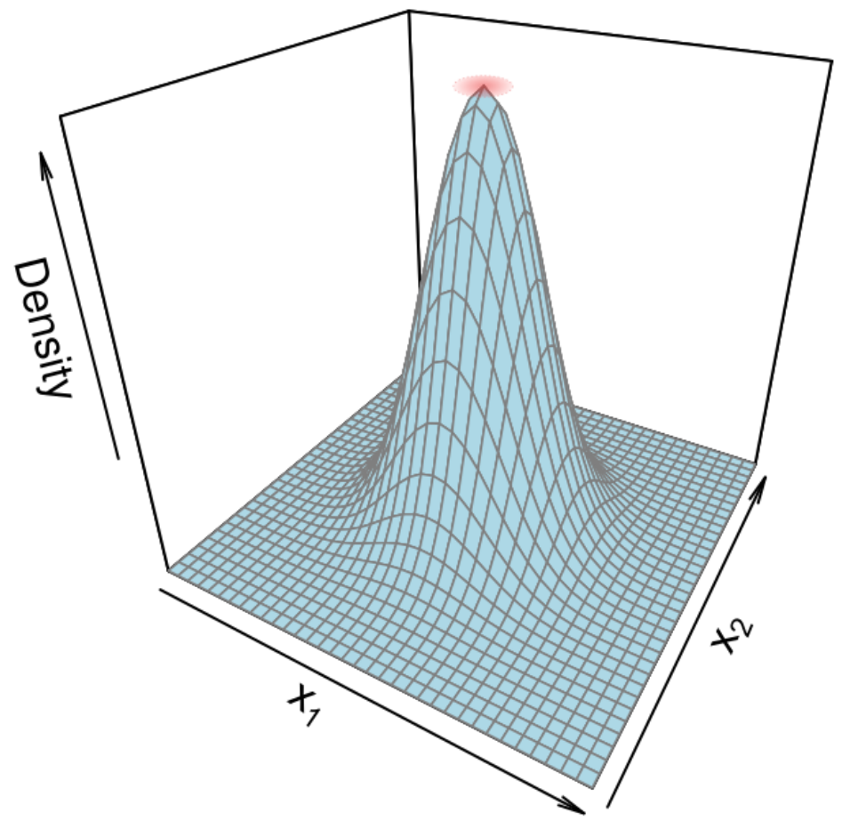

```{r setup, include=FALSE}
knitr::opts_chunk$set(dev = 'pdf')
```

# Simulación de presencias

### Especificación de un centroide

```{r echo = F, fig.align='center'}

```

-   Abundancia alcanza un máximo y disminuye
-   Modelos más complicados con varias variables

### Código - generando favorabilidad "verdadera"

```{r echo = F, message=F, warning=F}
library(terra); library(foreach); library(spatstat)

archivos <- list.files("Datos-ejemplos", "tif", 
                       full.names = T, 
                       recursive = F)
r <- rast(archivos)
r <- scale(r)
```

```{r}
centroide <- global(r, mean)
r.df <- as.data.frame(r, xy = T)
covar <- cov(r.df[, 3:5])
md <- mahalanobis(r.df[, 3:5], center = centroide$mean, cov = covar)
head(md)
```

### Código - viendo la favorabilidad

```{r fig.height=4, fig.width=4, fig.align='center'}
md.r <- rast(data.frame(r.df[, 1:2], md))
md.exp <- exp(-0.5*md.r)
plot(md.exp)
```

### Código - simulando los puntos

```{r warning = F, message=FALSE, results= "hide"}
set.seed(182)
sam <- sample(1:nrow(r.df), 200, prob = exp(-0.5*md))
puntos.2 <- data.frame(r.df[, 1:2][sam,])
puntos.2$x <- puntos.2$x + rnorm(200, 0, 0.05)
puntos.2$y <- puntos.2$y + rnorm(200, 0, 0.05)
```

### Código - favorabilidad y puntos

```{r echo=T, fig.height=4, fig.width=4, fig.align='center'}
plot(md.exp); points(puntos.2)
```

# Formateo para spatstat

### Cargando las funciones

```{r}
source("Funciones-spatstat/imFromStack.R")
source("Funciones-spatstat/winFromRaster.R")
source("Funciones-spatstat/plotQuantIntens.R")
```

### Formateo rápido

```{r}
r.im <- imFromStack(r)
names(r.im) <- paste("Var", 1:3, sep = ".")
w <- as.owin(r.im[[1]])
puntos.2.ppp <- ppp(x = puntos.2$x,
                  y = puntos.2$y,
                  window = w,
                  check = F)
Q <- pixelquad(X = puntos.2.ppp, W = as.owin(w))
```

# Análisis exploratorio

### Autocorrelación

```{r}
K <- envelope(puntos.2.ppp, fun = Kest, nsim = 39)
```

### Autocorrelación

```{r echo = F, fig.height=4, fig.width=4, fig.align='center'}
plot(K)
```

### Autocorrelación - notas

1.  Pareciera que el proceso está levemente autocorrelacionado
2.  No sabemos de momento si afectará al modelo
3.  Debemos poner atención al modelo ajustado

### Respuestas a variables

```{r}
plotQuantIntens(imList = r.im,
                noCuts = 5,
                Quad = Q,
                p.pp = puntos.2.ppp,
                dir = "",
                name = "Respuestas-centroide")
```

[Ver archivo de gráficas](Respuestas-centroide.pdf)

### Consideraciones para proponer modelos

Curvas con forma de campana $\rightarrow$ fórmula cuadrática

```{r fig.height=3.5, fig.width=3.5}
curve(exp(1 + x - x^2), from = -3, 3)
```

### Consideraciones para proponer modelos

Ecuación lineal:

$$ y = \alpha + \beta_1 x_1 + \dots + \beta_n x_n$$ Ecuación polinomial de 2$^o$ grado

$$ y = \alpha + \beta_1 x_1 + \beta_1' x_1^2 + \dots + \beta_n x_n + \beta_n' x_n^2$$ Recordemos que $y = \log \lambda$

### ¿Qué variables podemos incluir en el mismo modelo?

**Regla de oro**: Aquellas que no estén correlacionadas

-   Que $x_1$ no sea predictor de $x_2$
-   No se puede atribuir efecto de $x_1$ ó $x_2$ sobre $\lambda$
-   Necesitamos medir correlación entre pares de variables (`pairs`)

### Medición de correlación entre covariables

```{r fig.height=3.5, fig.width=3.5, fig.align='center'}
pairs(r)
```

### Variables *compatibles*

Podemos incluir en el mismo modelo:

1.  Var.1 y Var.3
2.  Var.2 y Var.3

Por lo tanto las fórmula polinomial

$$\log \lambda = \alpha  + \beta_1 x_1 + \beta_1' + x_1^2 + \beta_2 x_2 + \beta_2' + x_2^2 +$$

En **R**:

1.  `~ Var.1 + Var.3 + I(Var.1^2) + I(Var.3^2)`
2.  `~ Var.2 + Var.3 + I(Var.2^2) + I(Var.3^2)`

### Ajustando los modelos

```{r}
m1 <- ppm(Q = puntos.2.ppp,
          trend = ~ Var.1 + Var.3 + I(Var.1^2) + I(Var.3^2),
          covariates = r.im)
m2 <- ppm(Q = puntos.2.ppp,
          trend = ~ Var.2 + Var.3 + I(Var.2^2) + I(Var.3^2),
          covariates = r.im)
```

### Comparando los modelos

```{r}
AIC(m1); AIC(m2)
```

### Analizar los efectos estimados

```{r}
sum.m1 <- summary(m1)
knitr::kable(sum.m1$coefs.SE.CI[, 1:5])
```

### Diagnóstico - Residuales

```{r message = F, warning = F, fig.height=4, fig.width=4, fig.align='center', results = "hide"}
par(mar = c(2,2,2,2))
diagnose.ppm(m1, main = "", cex.axis = 0.25)
```

### Diangnóstico - Residuales

```{r message = F, warning = F, fig.height=4, fig.width=4, fig.align='center', results = "hide"}
par(mar = c(2,2,2,2))
diagnose.ppm(m2, main = "", cex.axis = 0.25)
```

### Diagnóstico - Ripley

```{r}
K1 <- envelope(m1, fun = Kest, nsim = 39)
K2 <- envelope(m2, fun = Kest, nsim = 39)
```
### Diagnóstico - Ripley

```{r fig.height=4, fig.width=4, fig.align='center'}
plot(K1, cex = 0.5)
```
### Diangóstico - Ripley

```{r fig.height=4, fig.width=4, fig.align='center'}
plot(K2, cex = 0.5)
```
### Resumen del análisis

- AIC menor para `m1`
- Residuales dentro de tolerancia para `m1`
- Prueba de ripley correcta para ambos modelos

    - No parece necesario modelar autocorrelación (lo haremos a continuación)
- Evidencia *favorece* a `m1`

### Revisando la predicción

```{r fig.height=4, fig.width=4, fig.align='center'}
plot(m1, se = F, main = "")
```

### Guardando los resultados

```{r warning = F, message=F, results = "hide"}
pred <- predict(m1)
pred.r <- rast(pred)
writeRaster(pred.r, "Predicción-m1.tif",
            overwrite = T)
```

# Modelando los efectos espaciales

### Modelos de interacción

- Estiman efecto aleatorio para puntos cercanos
- Sirven para procesos de exclusión o agregación moderada
- Hay varios tipos de interacciones entre puntos

### ¿Qué es interacción?

```{r echo = F, fig.align="center"}
knitr::include_graphics("Figuras/Interaccion-puntos.png")
```

### Tipos de interacciones

```{r echo = F, fig.align="center", fig.cap="Crédito a Baddeley et al (2016)"}
knitr::include_graphics("Figuras/Tipos-interacciones.png")
```

### Modelos de interacción en `spatstat`

```{r echo=F, fig.align="center"}
knitr::include_graphics("Figuras/Tabla-tipos-interacciones.png")
```

### Para generar un modelo de interacción

1. Establecer tamaño del búfer

```{r}
rr <- data.frame(r=seq(1,5,by=1))
p <- profilepl(rr, Strauss, 
               puntos.2.ppp ~ Var.1 + Var.3 + I(Var.1^2) + I(Var.3^2),
          covariates = r.im, aic=F, rbord = 0.1)
```
### Para generar un modelo de interacción

```{r echo=TRUE, fig.align="center", fig.height=4, fig.width=4}
plot(p, main = "")
```

### Para generar un modelo de interacción

Un radio de tamaño 2 minimiza la pseudo-verosimilitud, de modo que el modelo de interacción con la fórmula de m1 es:

```{r}
m1.int <- ppm(Q = puntos.2.ppp,
          trend = ~ Var.2 + Var.3 + I(Var.2^2) + I(Var.3^2),
          covariates = r.im,
          AreaInter(rr$r[p$iopt]), rbord = 0.1) #Interacción
```

### Efectos estimados

```{r message=F, warning=FALSE}
sum.int <- summary(m1.int)
knitr::kable(sum.int$coefs.SE.CI[, 1:4])
```

### Efectos estimados - comparación

```{r}
coef(m1)
coef(m1.int)
```

### Diangóstico

```{r}
K.int <- envelope(m1.int, Kest, nsim = 39)
```

### Diangóstico

```{r fig.height=4, fig.width=4, fig.align='center'}
plot(K.int)
```

### Favorabilidad

```{r echo=F, fig.align="center", fig.height=4, fig.width=4}
par(mfrow = c(1, 2))
plot(m1, se = F, trend = T, main = "Poisson")
plot(m1.int, se = F, trend = T, cif = F, main = "Interacción")
```

# Proceso Cox log-Gaussiano

### ¿Qué es?

- En MPPs

    - Intensidad es explicada por covariables si
    - Covariables rara vez explican puntos agregados
    
- Gaussiano = Distribución normal

    - Efecto aleatorio con distribución normal multivariada
    
### ¿Qué es?

$$\log \lambda_i = \alpha + \beta_1 x_{1,i} + \dots + G(u_i, v_i)$$
- $\alpha$ es el intercepto global
- $G(u_i)$ es el intercepto aleatorio para cada píxel
- Cuando todas las $x = 0$, la intensidad en el píxel $i$ es $\exp(\alpha + G(u_i))$

### ¿Con qué se ajusta un LGCP en **R**?

- Frecuentista - `spatstat` (rápido poco preciso)

- Bayesiano

    - `RINLA` (moderadamente rápido, moderadamente preciso)
    - `lgcp` (muuuuy lento, bastante preciso)

- Frecuentista son aproximaciones, y Bayesiano son estimaciones *verdaderas*

### Ajustando un LGCP con `spatstat`

```{r}
m1.lgcp <- kppm(puntos.2.ppp,
                trend = ~ Var.2 + Var.3 + I(Var.2^2) + I(Var.3^2),
                covariates = r.im,
                clusters = "LGCP",
                statistic = "K", # K de Ripley
                method = "mincon") # Modelo de varianza
```

### Ajustando un LGCP con `spatstat`

```{r}
sum.lgcp <- summary(m1.lgcp)
knitr::kable(sum.lgcp$coefs.SE.CI[, 1:4])
```

### Comparando con MPP

```{r}
knitr::kable(sum.m1$coefs.SE.CI[, c(1, 2, 3, 4)])
```

### Predicciones 

```{r fig.height=4, fig.width=4, message=FALSE, warning=FALSE, fig.align="center"}
par(mfrow = c(1, 3))
plot(m2, se = F, trend = T, main = "Poisson")
plot(m1.int, se = F, trend = T, cif = F, main = "Interacción")
plot(m1.lgcp, what = "intensity", main = "LGCP")
```

### Diagnóstico

```{r}
K.lgcp <- envelope(m1.lgcp, Kest, nsim = 39)
```

### Diangóstico

```{r fig.height=4, fig.width=4, message=FALSE, warning=FALSE, fig.align="center"}
plot(K.lgcp)
```

### Conclusiones

- Modelo Poisson 

    - Más simple, y no parece tener problemas
    - IC de estimaciones más amplios que LGCP

- Interacción

    - IC más amplios que MPP

- LGCP

    - Función K más cercana a expectativa teórica
### Alternativas de modelación

- Respuestas bisagra: Regresión por partes
- Respuestas no lineales: Suavizadores GAM
- Interacciones entre variables
- LASSO con paquete `ppmlasso` (Warton y Renner 2013)
