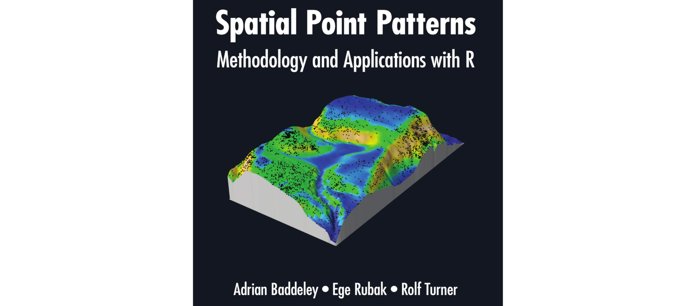
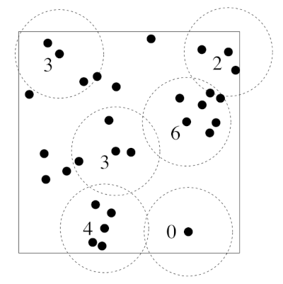
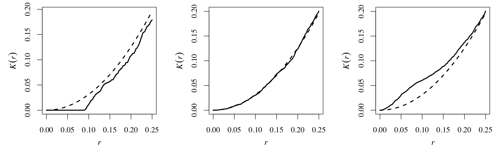

```{r setup, include=FALSE}
knitr::opts_chunk$set(dev = 'pdf')
```

# Introducción

### ¿Qué es `spatstat`?

- `spat` = Spatial
- `stat` = Statistics
- Paquete de **R** para hacer estadística espacial de procesos de puntos

    - Sintaxis típica de R básico
    - Objetos específicos del paquete

### Libro

Por desarrolladores del paquete

```{r echo = F}

```

### ¿Qué veremos aquí?

1. Instalación y carga
2. Formateo
3. Transformación de otros paquetes a `spatstat`
4. Análisis exploratorio

    4.1. Detección de autocorrelación
    4.2. Análisis de respuesta a covariables
    4.3. Propuesta de modelos en relación a covariables
    
5. Ajuste de modelo

# Instalación y carga

### Igual que cualquier paquete de **R**

Instalación

```{r echo=TRUE, eval=FALSE}
install.packages("spatstat")
```

Carga

```{r echo =TRUE, message=F, warning=F}
library(spatstat)
```

### Peeero

Necesitamos también (para leer raster de covariables):

```{r echo=TRUE, message=FALSE, warning=F}
library(rgdal)
library(raster)
library(foreach)
```

# Formateo

### Liga para los datos

[Variables ambientales](Datos-ejemplos/Covariables.zip)

### Carga de rasters

```{r echo = TRUE}
archivos <- list.files("Datos-ejemplos/", "tif", 
                       full.names = T, 
                       recursive = F)
r <- stack(archivos)
```

```{r echo=T, fig.height=3, fig.width=3, fig.align='center'}
plot(r[[1]])
```
### Transformar de `raster` a `im`

Si hacemos:

```{r}
class(r)
```

vemos que el tipo de objeto es `raster`, pero `spastat` utiliza `im`

Transformación en lote con [`imFromStack`](Funciones-spatstat/imFromStack.R)

### Transformar de `raster` a `im`

Para cargar `imFromStack`:

```{r}
source("Funciones-spatstat/imFromStack.R")
```

Y se usa:

```{r}
r.im <- imFromStack(r)
class(r.im)
```

### Ventana de trabajo

Cálculo de intensidad se hace con la "ventana". Utilizaremos la función [`winFromRaster`](Funciones-spatstat/winFromRaster.R):

```{r}
source("Funciones-spatstat/winFromRaster.R")
w <- winFromRaster(r)
```

Para verificar la clase del objeto:

```{r}
class(w)
```

### Puntos de ocurrencia

Vamos a simular las coordenadas $x$ y $y$ de un proceso de puntos:

```{r}
set.seed(984573)
puntos <- data.frame(coordinates(r)[sample(1:840, 200),])
puntos$x <- puntos$x + rnorm(200, 0, 0.05)
puntos$y <- puntos$y + rnorm(200, 0, 0.05)
```

El formato que requiere `spatstat` es `ppp`:

```{r}
puntos.ppp <- ppp(x = puntos$x,
                  y = puntos$y,
                  window = w,
                  check = F)
class(puntos.ppp)
```
### Puntos de ocurrencia

```{r fig.height=4, fig.width=4, fig.align='center'}
plot(puntos.ppp)
```

# Análisis exploratorio

### Detección/medición de autocorrelación

- Análisis visual

```{r echo = F, fig.align='center'}

```

### Función de Ripley

```{r echo = F}

```

### Función de Ripley

```{r eval = F}
K <- envelope(puntos.ppp, fun = Kest, nsim = 39)
```

- `puntos.ppp` objeto que contiene los puntos
- `fun = Kest` función que se estimará
- `nsim = 39` número de simulaciones para IC al 95%

### Función de Ripley

```{r eval=T, fig.align='center', fig.height=3, fig.width=3, results='hide'}
K <- envelope(puntos.ppp, fun = Kest, nsim = 39)
plot(K)
```

### Análisis de respuesta a covariables

- Función `rhohat` de `spatstat`

    - Gráfica de intensidad en relación a covariable
    - Suavizada
    
- Implementada en lotes con [plotQuantIntens](Funciones-spatstat/plotQuantIntens.R)

### Análisis de respuesta a covariables

Uso de `plotQuantIntens`:

```{r}
Q <- pixelquad(X = puntos.ppp, W = as.owin(w))

source("Funciones-spatstat/plotQuantIntens.R")
plotQuantIntens(imList = r.im,
                noCuts = 5,
                Quad = Q,
                p.pp = puntos.ppp,
                dir = "",
                name = "Respuestas")
```
# Ajuste del modelo

### Supuestos

- Las variables ambientales no están correlacionadas
- Que la intensidad es log-lineal en relación a covariables

### Código

Se usa función `ppm`

```{r}
m1 <- ppm(Q = puntos.ppp,
          trend = ~ Var.1,
          covariates = r.im)
```

- `Q` es el proceso de puntos
- `trend` es la fórmula del modelo
- `covariates` es la lista de variables ambientales

### Resultados

```{r}
summary(m1)
```

### Comparación de modelos

```{r}
m2 <- ppm(Q = puntos.ppp,
          trend = ~ Var.2,
          covariates = r.im)

m3 <- ppm(Q = puntos.ppp,
          trend = ~ Var.3,
          covariates = r.im)

AIC(m1); AIC(m2); AIC(m3)
```
### El modelo "mejor"

```{r fig.height=3, fig.width=3, fig.align='center'}
plot(m2, trend = T, se = F)
```

# Para concluir

### Por hacer

- Verificar significancia de efectos
- Verificar residuales (lo que el modelo no explicó)
- Supuestos

    - Pertinencia del "área de calibración"
    - Pertinencia del sistema de referencia de coordenadas
    - Supuesto de independencia rara vez se cumple
    - Proponer modelos de interacción o gaussianos
